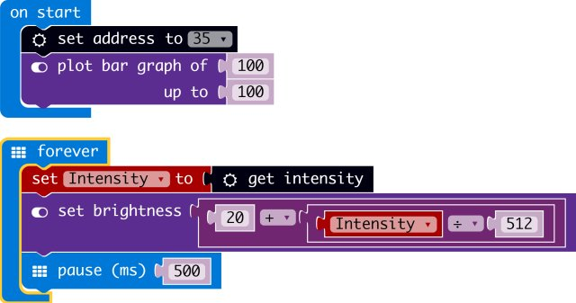

# BH1750

makecode BH1750 Digital Ambient Light Sensor package for micro:bit  

Author: shaoziyang  
Date:   2018.Mar  
  


## Add extension

open your microbit makecode project, in Add extension, paste  

https://github.com/microbit-makecode-packages/BH1750  

to search box then search.

## Basic usage
```
let Intensity = 0
BH1750.SetAddress(BH1750_ADDRESS.A35)
led.plotBarGraph(
100,
100
)
basic.forever(() => {
    Intensity = BH1750.getIntensity()
    led.setBrightness(20 + Intensity / 512)
    basic.pause(500)
}) 
```

## I2C Address  
- 35/92 

## API

- SetAddress(addr: BH1750_ADDRESS)  
addr is BH1750 address, it maybe 35 or 92  

- on()  
turn on BH1750.

- off()
turn off BH1750, to reduce power consumption.

- getIntensity()  
get ambient light data

## Demo



## License

MIT

Copyright (c) 2018, microbit/micropython Chinese community  

## Supported targets

* for PXT/microbit


[From microbit/micropython Chinese community](http://www.micropython.org.cn)
